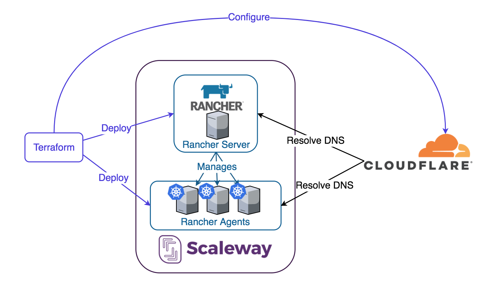
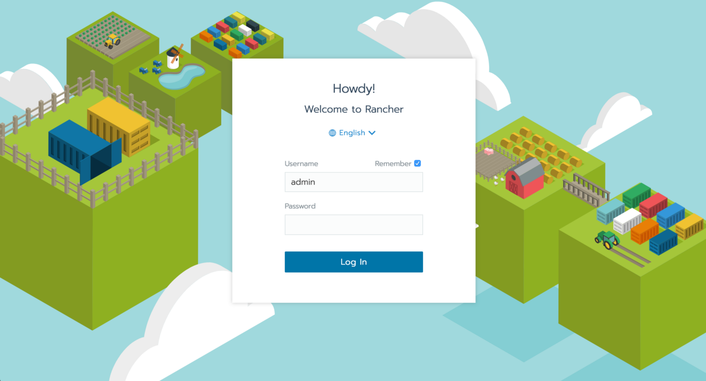
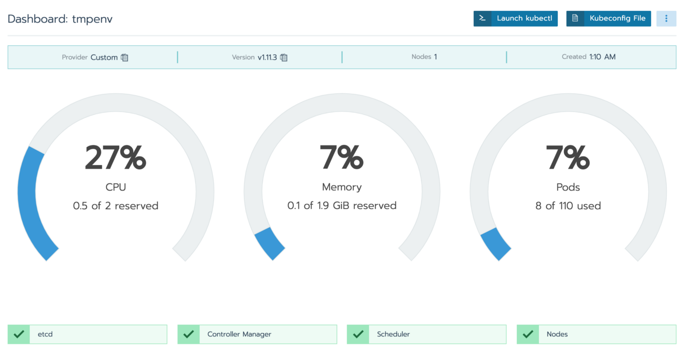

# Kubernetes on Scaleway with Rancher and Terraform

Deploy Rancher and Kubernetes on Scaleway using Terraform (with DNS on Cloudflare).

This terraform is based on the [DO quickstart deployment of Rancher](https://github.com/rancher/quickstart/tree/master/do)

## Overview



## Prerequisites

* Prepare a [Scaleway](https://www.scaleway.com/) account
* Prepare a [Cloudflare](https://www.cloudflare.com/) account
* Setup at least 1 zone in [Cloudflare](https://www.cloudflare.com/)
  * You can get a free domain at services like [Freenom}(https://www.freenom.com/)
* Install [terraform](https://www.terraform.io/intro/getting-started/install.html)
* Install [kubectl](https://kubernetes.io/docs/tasks/tools/install-kubectl/)

## Jump Start

**!!WARNING!!** This will deploy resources to Scaleway and be sure that they are going to cost you money.

### Set up the tfvars

`rancherserver/terraform.tfvars`

Be sure to set the following variables:

* scw_access_key
  * Your Scaleway Access Key
* scw_token
  * Your Scaleway Secret Token
* scw_org
  * Your Scaleway Organization ID
* admin_password
  * The password you're going to use for the Rancher Server
* rancher_server_url
  * The URL you will use for your Rancher Server. This terraform is going to setup a rancher subdomain to your cloudflare zone. So if your zone is example.com , this terraform will create an A record to resolve rancher.example.com .
* cloudflare_email
  * Your Email for Cloudflare
* cloudflare_api_key
  * Your Cloudflare API Key
* cloudflare_zone_id
  * Your Cloudflare zone ID

`rancheragent/terraform.tfvars`

Be sure to set the following variables:

* rancher_server_address
  * The address for your Rancher Server. It can either be an IP or domain name but I would recommend the domain name you set previously.
* count_agent_all_nodes
  * This is how many nodes to create that have all the roles(etcd, controlplae, worker). If you're just experimenting with the Kubernetes cluster, having one of this will be enough.
* count_agent_etcd_nodes
  * This is how many nodes to create that have the etcd role
* count_agent_controlplane_nodes
  * This is how many nodes to create that have the controlplane role
* count_agent_worker_nodes
  * This is how many nodes to create that have the worker role

### Deploy the Rancher Server resources

```bash
cd rancherserver
terraform apply
```

### Deploy the Rancher Agent resources

```bash
cd rancheragent
terraform apply
```

## Check it out





## Clean up

**Destroy the Rancher Agent and related resources**
```bash
cd rancheragent
terraform destroy
```

**Destroy the Rancher Server and related resources**
```bash
cd rancherserver
terraform destroy
```